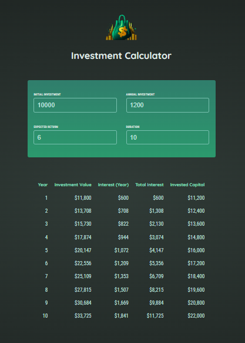

# React Investment Calculator

This is a simple web application built with React for calculating investment growth over time. It allows users to input their initial investment amount, annual interest rate, and investment duration to estimate the future value of their investment.

## Features

- Investment calculation: Calculate the future value of an investment based on user input.
- Interactive user interface: Provide an intuitive interface for users to input investment parameters.
- Visual representation: Display the investment growth graphically to help users understand the potential returns over time.

## Technologies Used

- React: JavaScript library for building user interfaces.

## Credits:
This project is inspired by React - The Complete Guide 2024 (incl. React Router & Redux).

## License:
This project is licensed under BenHammouda Mohamed Ali.

### Dashboard:

